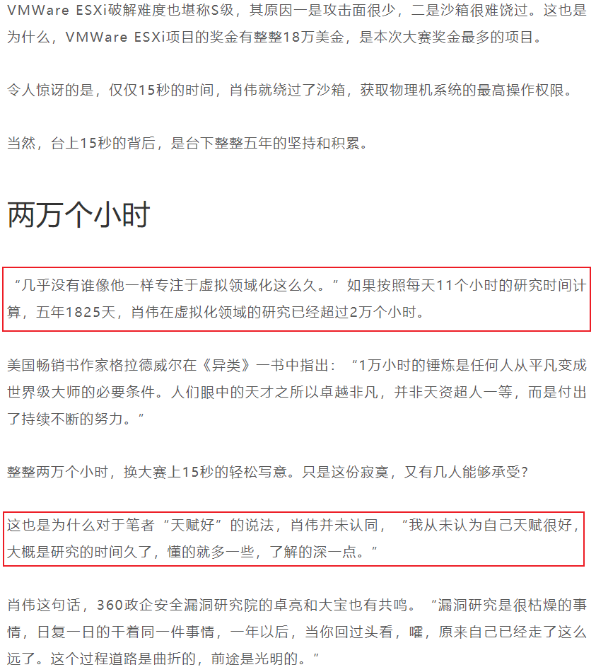

在之后的学习中会记录自己每天花在虚拟化上的时间，以下图勉励自己，希望自己可以追赶上别人的步伐

写于2020.12.14

虚拟化：8 hours

# Learning_Record

第一周  ( 2020.6.29 - 2020.7.5 )  :  STL(一)

- 弄完STL vector
- 补C++
- 南大计算机基础

第二周  ( 2020.7.06 - 2020.7.12 )  :  STL(二)

- 弄完STL list tree
- csapp 看到 2.3.2

第三周  ( 2020.7.13 - 2020.7.19 )  :  CSAPP Lab(一)

- Data Lab
- Bomb Lab
- Attack Lab
- Cache Lab

第四周  ( 2020.7.20 - 2020.7.26 )  :  CSAPP Lab(二)

- Malloc Lab
- Shell Lab

第五周  ( 2020.7.27 - 2020.8.2 )  :  Ucore Lab(一)

- 看完csapp
- Ucore Lab1

第六周  ( 2020.8.3 - 2020.8.9 )  :  Ucore Lab(二)

- Ucore Lab2-6
- Ucore 扩展做到 Lab1

第七周  ( 2020.8.10 - 2020.8.16 )  :  Ucore Lab(三)

- Ucore Lab7
- Ucore 扩展做到 Lab5

第八周  ( 2020.8.17 - 2020.8.23 )  :  Ucore Lab(四)

- Ucore Lab8
- Ucore 扩展做到 Lab7
- 整理6个关于整数/浮点数的CVE漏洞

第九周  ( 2020.8.24 - 2020.8.30 )  :  Ucore Lab(五)

- Ucore Lab 8 扩展
- 复现DirtyCow
- Makefile
- Google CTF sprint

第十周  ( 2020.8.31 - 2020.9.6 )  :  Ucore Lab(六)

- Ucore Lab 8 扩展
- 复现DirtyCow
- Makefile
- Google CTF sprint

第十一周  ( 2020.9.7 - 2020.9.13 )  :  Unix and P4CTF

- P4CTF KVM
- Unix 第一章

第十二周  ( 2020.9.14 - 2020.9.20 )  :  Unix and PlaidCTF

- PlaidCTF sandybox
- Unix 第四章

第十三周  ( 2020.9.21 - 2020.9.27 )  :  Qemu(一)

- Blizzard CTF
- Qemu 2.3
- ELF解析器

第十四周  ( 2020.9.28 - 2020.10.4 )  :  Qemu(二)

- Rdb调试器
- Qemu 2.5

第十五周  ( 2020.10.05 - 2020.10.11 )  :  Qemu(三)

- Qemu 3
- HITB CTF
- C语言实现面向对象
- 搭建漏洞复现环境

第十六周  ( 2020.10.12 - 2020.10.18 )  :  Qemu(四)

- day1: 搭建漏洞复现环境
- day2: 搭建漏洞复现环境
- day3: 复现CVE-2015-5156 写完 poc 和 exp
- day4: 复现CVE-2015-7504 分析完漏洞成因和执行流程
- day5: 复现CVE-2015-7504 写完 poc 由于涉及一个crc校验所以exp没有写出来
- day6: GACTF babyqemu
- day7: N1CTF Kemu 尝试做了一下  没做出来

第十七周  ( 2020.10.19 - 2020.10.25 )  :  Qemu(五)

- 2020.10.19  :  

  - [ ] N1CTF Kemu 没做完

- 2020.10.20：

  - [x] 2019 Qwb Qwct 这道题和之前的比起来就是多了一个对输入的数据会进行一些操作

    **漏洞模式1：当存储数据的buffer被填充满的时候，使用strlen得到的结果可能会是比理想值大的，因为其会把buffer后面的内容的长度也算进去**

    **漏洞模式2：以数组的size作为下标的时候，会导致读取或写入的时候，读取或写入到数组后面的区间**

- 2020.10.21：

  - [x] C++ prime 看了一下 以前没有注意到的章节
  - [x] 刷了两道LeetCode的简单题，一道是检验输入的字符是否是长按产生的利用双指针方法，一道是利用两个栈来替代队列使用的方法是一个栈用来主要存储数据另一个栈来辅助存储和汉诺塔比较类似

- 2020.10.22：

  - [x] Pwnable 3 道题，由于gdb环境崩了，所以就只做了3道，第一道start是个很简单的栈溢出然后往栈上写shellcode，第二道也是往栈上写shellocde使用orw，第三道有趣一些是一个计算器不过计算器对数据处理的不够细致在输入如"+666"这种数据的时候会导致越界读或写
  
- 2020.10.23：

  - [x] N1CTF Kemu  收尾，以前没遇见过的题目类型，修改了原有的qemu设备代码，而不是自己新添加的设备，而且还涉及到了一个附属设备的东西
  
- 2020.10.24:

  - [ ] ByteCtf 尝试做了qiao 和 gun，qiao涉及了ollvm混淆就没做出来，gun的洞在哪也没找到

- 2020.10.25：

  - [x] qemu看完i440fx初始化，准备加速看一下那本书，理一下虚拟机初始化的过程，然后仔细看看源码
  - [x] 在wh1te师傅的帮助下，解出qiao，完成byetctf签到，ORZ
  - [ ] 整理qiao和easyheap的漏洞模式，但是没看出哪里有洞，ORZ

第十八周  ( 2020.10.26 - 2020.11.1 )  :  Qemu(六)

- 2020.10.26  :
  - [x] qemu 书看到fw_cfg设备那里，又回头看了下前面关于QOM那里的内容，对于qemu中实现的面向对象脑中有一个大概的框架，关于主板初始化，书中主板初始化这章也涉及了很多后面的章节的内容，不过对于主板初始化来说主要就是这几个步骤，创建北桥、创建PCI根总线、创建根PCI总线上北桥部分、创建初始化相关的MemoryRegion、创建PIIX3设备，对于虚拟机初始化来说，主要是下面几个步骤，内存计算，CPU初始化，内存初始化，主板初始化，中断初始化
  - [x] 分析了一下主板初始化的源码，不过没有分析完，复习了一下QOM相关的代码
  - [x] 两道leetcode题，第一道是计算数组中比当前数字小的数字的个数(利用二叉树思想做的)，第二道是判断是不是平衡树，方法是用前序遍历，每一次遍历都计算一次深度，然后做差进行对比
- 2020.10.27：
  - [x] qemu 书看完fw_cfg设备，fw_cfg设备主要的作用是用来给虚拟机转递信息的，包括给bios传递之前初始化过的主板上的硬件当中的信息，并且也可以给虚拟系统传文件，也可以起到像是一个微型的vmtools的作用。seabios并没有深究，因为这个seabios设计到的是bios的代码，和虚拟化感觉有关系但是关系并不是特别大，所以略读了一下
  - [x] 安好了codeql，简单的学了一些ql语法，审了一下freetype
  - [x] 两道leetcode题，第一道是二叉树的前序遍历直接套模板就可以了，第二道是求二叉树的最大深度这道题也是利用前序遍历，然后根据depth = max(depth(root->left) + depth(root->right)) + 1这个公式可以计算出来，左右子树的深度，然后找最大的就可以了
- 2020.10.28：

  - [x] 两道leetcode题，第一道是检测是不是对称的二叉树，第二道是把二叉树对称转换一下
- 2020.10.29：
- [x] 社团招新，省赛备赛
- 2020.10.30：
  
  - [x] 社团招新，省赛备赛
- 2020.10.31：
  - [x] 社团招新，省赛备赛
  
- 2020.11.1：
  - [x] 社团招新，省赛备赛

第十九周  ( 2020.10.26 - 2020.11.1 )  :  虚拟化+备赛

-   2020.11.2：
    - [x] linux下的反调试，linux下的反调试的原理是因为gdb它动调的原理是使用ptrace，所以我们在程序里如果加了一句只可以被一个进程追踪的话，那么被gdb加载动调的时候就会直接结束
    - [x] 脱linux下的upx壳，脱upx壳就是利用ida远程动调，然后再利用idc脚本把程序dump出来，然后再进行之后的静态分析或动调调试
    - [x] 利用上面的两个知识点出了道题，攒fuzz机
-   2020.11.3：
    
    - [x] 尝试使用ptrace把反调试加固一下，加固的方法就是子进程所有执行的函数全部都是我们改写的函数，也就相当于一个小型的虚拟机，子进程中执行的是伪指令，真正的指令是在父进程中进行解释的，(准备用这个知识点出一道题)
    - [x] 复习一下base64加解密的原理
    - [x] 两道leetcode题，第一道是二叉树的最近公共祖先，最近公共祖先的定义为：“对于有根树 T 的两个结点 p、q，最近公共祖先表示为一个结点 x，满足 x 是 p、q 的祖先且 x 的深度尽可能大（一个节点也可以是它自己的祖先）这道题的解决方法是通过递归对二叉树进行后序遍历，当遇到节点 pp 或 qq 时返回。从底至顶回溯，当节点 p,q 在节点 root 的异侧时，节点 root 即为最近公共祖先，则向上返回 root；第二道是从上到下打印二叉树 II，这道题是使用的别人的方法，首先现根据当前结点，计算出下一层一共有多少个结点，然后打印本层结点的时候，每打印完一次，就把当前层结点数量减一，当节点数量为0时则打印完毕，当前层打印完毕就开始打印下一层
-   2020.11.4：

    - [x] 比赛备赛

    - [x] 两道leetcode题，第一道是寻找二叉搜索树中的第k大结点，二叉搜索树定义：二叉搜索树，它或者是一棵空树，或者是具有下列性质的二叉树：若它的左子树不空，则左子树上所有结点的值均小于它的根结点的值；若它的右子树不空，则右子树上所有结点的值均大于它的根结点的值；它的左、右子树也分别为二叉搜索树。利用的方法是二叉搜索树的中序遍历(左中右)为一个递增的有序序列，反中序遍历(右中左)为递减的有序序列，我起初的想法是遍历树上的所有结点，然后把所有的值存起来，然后对所有的值排序，排序之后再求第k大的结点，中间步骤太多所以超时了；第二道是二叉搜索树的最近公共祖先，和昨天做的那道二叉树的最近公共祖先一样的解法
-   2020.11.5：
  - [x] 出题恰钱，去ollvm混淆的时候，会修改程序逻辑，所以原先写的代码逻辑就不可以用了，得重新写一下，所以得明天才能出完了
  - [x] 两道leetcode题，第一道是合并二叉树，找到四个临界条件，两个树的结点都存在，第一个树的结点存在第二个树的结点不存在，第一个树的结点不存在第二个树的结点不存在，两个树的结点都不存在，根据这四个结点做相应操作即可，第二道是平衡二叉树，遍历每个结点的左右子树，然后计算出深度差，检测深度查是不是大于1即可
-   2020.11.6：
    - [x] 出完题目
    - [x] 学了一下codeql，主要是做了一下CodeQL U-Boot Challenge这个实验，一共有十个实验，做完了9个，然后翻译了一下官方的关于类的文档，没有翻译完，翻译了一半，感觉ql里面的类和c++的类很像
    - [x] 三道leetcode题，两道都是重复的题，相当于复习了，一道是对称二叉树，一道是翻转二叉树，对称二叉树的思路：比如有两个同一层的节点，a和b，用a的左和b的右做对比，用a的右和b的左做对比，然后再把边界考虑好即可；第二道是翻转二叉树，就正常的交换即可，第三道是单值二叉树，考虑好边界条件，然后遍历即可
-   2020.11.7：
    - [x] 做完CodeQL U-Boot Challenge实验，这个实验最后的step-10，难度比之前高了很多，所以这个实验用了挺长时间
    - [x] Codeql看了以下数据流的相关文档，中间有很多翻译不过来的东西，而且也就理解了大概意思(自认为)
-   2020.11.8：
    - [x] 两道leetcode，第一道是二叉树的直径，这道题就是二叉树深度的变种题，改一改就可以过了；第二道是修剪二叉搜索树，因为是二叉搜索树所以就简单了许多，有两种情况，当前节点是小于low还是大于high，小于low就减掉左子树保留右子树，如果大于high就减掉右子树保留左子树
    - [x] 翻译了一下迭代器的库的文档，但是没太搞懂怎么用

第二十周  ( 2020.11.9 - 2020.11.15 )  :  Ptmalloc

-   2020.11.9：
    
    - [x] ctf-wiki，为了比赛看了下ptmalloc部分的文档
    - [x] 两道leetcode
-   2020.11.10：
    
    - [x] Chunk Extend and Overlapping 学习 做wiki上相关例题
-   2020.11.11：
    
    - [x] Fastbin Attack 学习 做wiki上相关例题
-   2020.11.12：
    
    - [x] Unsorted Bin Attack 学习 做wiki上相关例题
-   2020.11.13：
    
    - [x] libc2.23 Tcache Attack 学习 做Wiki上相关例题
-   2020.11.14：
    
    - [x] 做两道和malloc_consolidate有关的题目
-   2020.11.15：
    - [x] House Of Einherjar 学习 做wiki上相关例题

第二十一周  ( 2020.11.16 - 2020.11.22 )  :  Ptmalloc

-   2020.11.16：

    - [x] 阅读wiki上深度理解ptmalloc那一章
    - [x] 阅读ptmalloc源码
-   2020.11.17：
    
    - [x] 学习libc2.31版本的各种漏洞利用方式
-   2020.11.18：
    
    - [x] Tcache stash unlink attack 学习 做相关的题目
-   2020.11.19：
    
    - [x] 阅读并调试shellphish的how2heap(看的2.23和2.27部分)
    - [x] IO_FILE攻击学习（一）
-   2020.11.20：
    
    - [x] 阅读并调试shellphish的how2heap(看的2.31部分)
    - [x] IO_FILE攻击学习（二）
-   2020.11.21：
    
    - [x] 比赛第一天，输出两道题目，一道是利用的Tcache stash unlink attack攻击，另一道是用到了没有学过的知识点，就是当scanf获取的输入过长时，他会申请一个largebin来存输入，这样就可以触发malloc_consolidate，然后就可以通过uaf泄露出libc了
-   2020.11.22：
    
    - [x] 比赛第二天，输出两道题目，一道是C++ pwn，这道题有一个越界写但是具体的利用方法不太知道，就是很玄学，另一道是堆风水

第二十二周  ( 2020.11.23 - 2020.11.29 )  :  Qemu(七)

-   2020.11.23：
    - [x] 复现一下周六周日比赛没做出来的一个题
    - [x] 周六周日比赛睡得有点太晚，没啥精神，下午就又睡了一会，晚上有些别的事情
-   2020.11.24：
    
    - [x] 阅读qemu内存初始化那一章，最开始这部分和操作系统中内存管理差不多，主要就是介绍了一下寻址机制(影子页表与EPT)
    - [x] leetcode两道题，第一道是简单的贪心算法，给孩子分配饼干，贪心策略是给剩余孩子里最小饥饿度的孩子分配最小的能饱腹的饼干。第二道也是一道简单的贪心算法，贪心策略为在每次遍历中，只考虑并更新相邻一侧的大小关系。
-   2020.11.25：
    - [x] 阅读qemu 2.8.1有关内存初始化相关的代码，qemu中模拟的虚拟机内存是以树形链接起来的，然后为了配合kvm需要将树形平坦化来提交给kvm，其中影子页表是可以直接把gpa转换成hpa但是效率低下，还有就是在ept机制下，只有在进入了虚拟机模式下才会开启ept寻址机制，如果不在虚拟机模式下就还是正常的虚拟地址到物理地址的转换机制
    - [x] leetcode两道题，两道贪心算法的题，第一道是要在给定的几个区间中，去除掉重复的区间，来保证剩余的区间内没有重叠的区间，使用的策略是把所有区间按右区间值来排序，然后从小到大遍历，比较左区间和右区间的值来选择去除还是保留，第二道是种花问题，要求是种的花左右不能再种花，使用的策略是，从左到右遍历，如果说当前点的左右都没种花，那么把这点种上花，然后种的数量+1，最后把种的数量与要求种的数量做对比即可
-   2020.11.26-29：
    - [x] Codeql弄了github上的两个例子，不过有一些东西搞了好久才懂该怎么弄

第二十三到第二十四周  ( 2020.11.30 - 2020.12.13 )  :  比赛

-   2020.11.30-2020.12.13：
    - [x] 这两周有考核还有线下赛，就没有每天写周报了，14号之后再继续开始

第二十五周  ( 2020.12.14 - 2020.12.20 )  :  Qemu

- 2020.12.14：

  - [x] 复现了一下CVE-2020-14364 Qemu逃逸漏洞，里面涉及了一些usb的相关知识，需要先了解一下usb的相关知识，因为我们需要伪造数据包，所以需要知道usb发包收包的代码怎么写，漏洞成因基本已经了解，弄明白usb部分就可以写出exp了
  - [x]  看了一下深入理解linux内核，复习复习操作系统相关知识
  
  